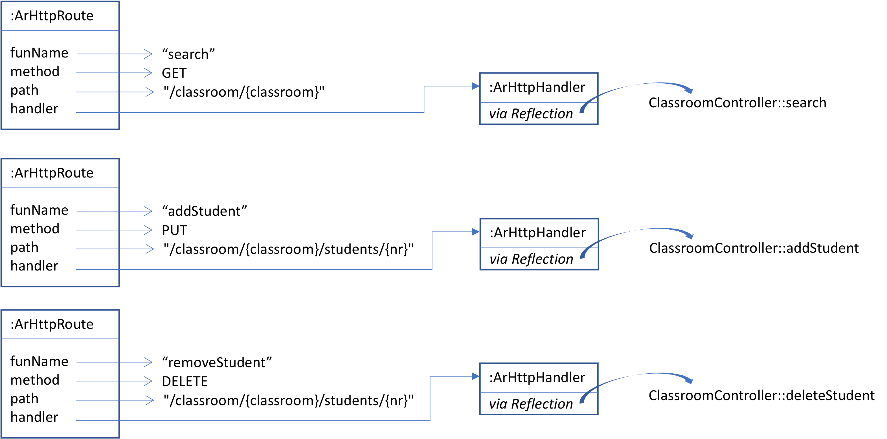
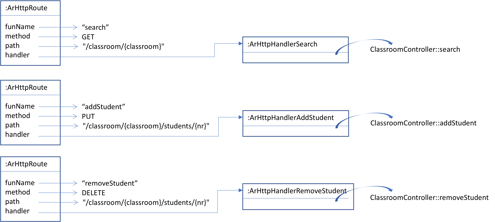

## Types at runtime and Reflection API

The AutoRouter library allows the automatic creation of HTTP handlers for a 
[`pt.isel.autorouter.JsonServer`](autorouter/src/main/java/pt/isel/autorouter/JsonServer.java)
based on a router object with specific annotations, according to the next [example of `ClassroomRouter`](#classroomrouter-example).

All methods annotated with `@ArMethod`, `@ArPath` and returning an `Optional` are eligible
for HTTP handlers.
To avoid ambiguity with existing types of JDK we choose to prefix annotations with `Ar`.

For simplicity, [`JsonServer`](autorouter/src/main/java/pt/isel/autorouter/JsonServer.java) 
is only responding with status codes of 200, 404, and 500, depending 
on whether the handler returns a fulfilled `Optional`, an empty `Optional` or an exception.
(you may consider the use of an alternative `Either`, or other type to enhance responses)

The Java function `Stream<ArHttpRoute> autorouterReflect(Object router)` builds
a stream of [`ArHttpRoute`](autorouter/src/main/java/pt/isel/autorouter/ArHttpRoute.java)
objects for each eligible method in given `router` object parameter.

The next figure shows the resulting stream of
[`ArHttpRoute`](autorouter/src/main/java/pt/isel/autorouter/ArHttpRoute.java) objects
for the example of a [`ClassroomRouter` instance](#classroomrouter-example).
The `autorouterReflect` can be use in Kotlin through a statement such as:

```kotlin
ClassroomRouter().autorouterReflect().jsonServer().start(4000)
```



#### ClassroomRouter example

```kotlin
class ClassroomRouter {
    /**
     * Example: http://localhost:4000/classroom/i42d?student=jo
     */
    @ArMethod(GET)
    @ArPath("/classroom/{classroom}")
    fun search(@ArRoute classroom: String, @ArQuery student: String?): Optional<List<Student>> {
        ...
    }
    /**
     * Example:
     *   curl --header "Content-Type: application/json" \
     *     --request PUT \
     *     --data '{"name":"Ze Gato","group":"11", "semester":"3"}' \
     *     http://localhost:4000/classroom/i42d/students/7777
     */
    @ArMethod(PUT)
    @ArPath("/classroom/{classroom}/students/{nr}")
    fun addStudent(
        @ArRoute classroom: String,
        @ArRoute nr: Int,
        @ArBody name: String,
        @ArBody group: Int,
        @ArBody semester: Int
    ): Optional<Student> {
        ...
    }
    /**
     * Example:
     *   curl --request DELETE http://localhost:4000/classroom/i42d/students/4536
     */
    @ArMethod(DELETE)
    @ArPath("/classroom/{classroom}/students/{nr}")
    fun removeStudent(@ArRoute classroom: String, @ArRoute nr: Int) : Optional<Student> {
        ...
    }
}
```

## Dynamic Code Generator and Performance Evaluation with JMH

Here we follow a different approach to invoke the functions of a router object.
Instead of using Reflection we will generate different implementations of `ArHttpHandler`
for each function in router object, as denoted in the next figure.
Notice, these implementations (e.g. `ArHttpHandlerSearch`, `ArHttpHandlerAddStudent`, `ArHttpHandlerRemoveStudent`)
do not use reflection to call the methods of `ClassroomRouter`.



## Usage

To run these benchmarks on you local machine just run:

```
./gradlew jmhJar
```

And then:

```
java -jar autorouter-bench/build/libs/autorouter-bench-jmh.jar -i 4 -wi 4 -f 1 -r 2 -w 2 
```

* `-i`  4 iterations
* `-wi` 4 warmup iterations
* `-f`  1 fork
* `-r`  2 run each iteration for 2 seconds
* `-w`  2 run each warmup iteration for 2 seconds.

### Results on 2023-02-20 

Apple M1 Pro with OpenJDK Runtime Environment Corretto-17.0.5.8.1 

```
Benchmark      (approach)   (domain)   Mode  Cnt      Score      Error   Units
addStudent        reflect      empty  thrpt    4   3773.368 ±  264.859  ops/ms
addStudent        reflect  classroom  thrpt    4   3790.482 ±  313.750  ops/ms
addStudent        dynamic      empty  thrpt    4   9025.689 ±  714.827  ops/ms
addStudent        dynamic  classroom  thrpt    4   4853.550 ±  582.861  ops/ms
addStudent       baseline      empty  thrpt    4  10762.076 ± 1305.249  ops/ms
addStudent       baseline  classroom  thrpt    4   5335.725 ± 2142.943  ops/ms
removeStudent     reflect      empty  thrpt    4  13438.279 ±  279.203  ops/ms
removeStudent     reflect  classroom  thrpt    4  10272.376 ±  244.500  ops/ms
removeStudent     dynamic      empty  thrpt    4  32286.002 ±  879.368  ops/ms
removeStudent     dynamic  classroom  thrpt    4  26031.841 ±  191.146  ops/ms
removeStudent    baseline      empty  thrpt    4  33042.347 ±   84.395  ops/ms
removeStudent    baseline  classroom  thrpt    4  25804.282 ±  220.817  ops/ms
search            reflect      empty  thrpt    4  20238.233 ±  125.485  ops/ms
search            reflect  classroom  thrpt    4  20223.444 ±  131.934  ops/ms
search            dynamic      empty  thrpt    4  95606.066 ±  971.023  ops/ms
search            dynamic  classroom  thrpt    4  95367.123 ± 1937.836  ops/ms
search           baseline      empty  thrpt    4  95250.903 ± 2881.199  ops/ms
search           baseline  classroom  thrpt    4  95665.850 ± 1400.391  ops/ms
``````
